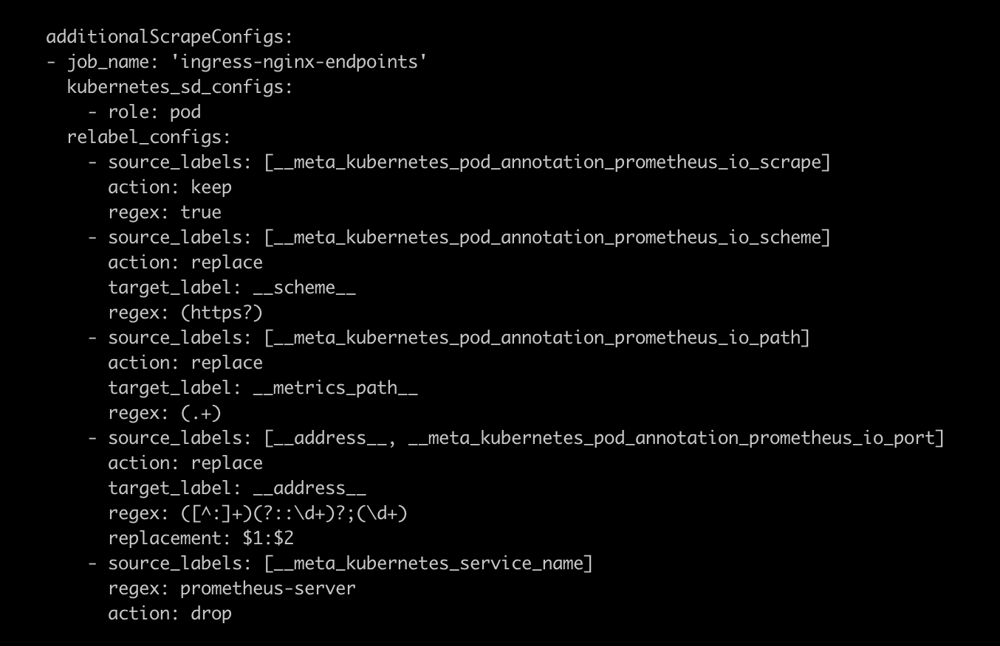

## Практика
### 1. Получаем доступ к мониторингу    
### 2. Рассмотрим, что мы можем получить от [Kubernetes Metrics Server](https://github.com/kubernetes-sigs/metrics-server)  
### 3. Получим доступ к метрикам, которые отдает Kubelet  
### 4. Настроим сбор метрик из нашего "приложения"
### 5. Рассмотрим базовые запросы PromQL
### 6. Prom Operator TIPS & TRICKS


--


### 1. Получаем доступ к мониторингу  

**Логин к Grafana**  
`kubectl get secret -n monitoring prometheus-operator-grafana -o json | jq -r '.data."admin-user"' | base64 -d`  

**Пароль к Grafana**  
`kubectl get secret -n monitoring prometheus-operator-grafana -o json | jq -r '.data."admin-password"' | base64 -d`  

**Список обслуживаемых доменов (столбец HOSTS)**  
`kubectl get ing -n monitoring`  

**Меняем логин и пароль на prometheus**  
Создаем htpasswd файл с логином и паролем  
pm-user - заменить на Ваш логин  
pm-pass - заменить на Ваш пароль  
`htpasswd -bc auth pm-user pm-pass`  

Удаляем старый секрет  
`kubectl delete secret -n monitoring prometheus-secret`  

Создаем новый секрет  
`kubectl create secret -n monitoring generic prometheus-secret --from-file=auth`

**Меняем логин и пароль на alertmanager**  
Создаем htpasswd файл с логином и паролем  
am-user - заменить на Ваш логин  
am-pass - заменить на Ваш пароль  
`htpasswd -bc auth am-user am-pass`  

Удаляем старый секрет  
`kubectl delete secret -n monitoring alert-secret`  

Создаем новый секрет  
`kubectl create secret -n monitoring generic alert-secret --from-file=auth`

**Устанавливаем утилиту jq** - [https://stedolan.github.io/jq/](https://stedolan.github.io/jq/)

--

### 2. Рассмотрим, что мы можем получить от [Kubernetes Metrics Server](https://github.com/kubernetes-sigs/metrics-server)  

Запросим напрямую из API инофрмацию о ресурсах утилизированных на воркерах    
`kubectl get --raw /apis/metrics.k8s.io/v1beta1/nodes | jq .`  

Запросим напрямую из API инофрмацию о ресурсах утилизированных в Pod     
`kubectl get --raw /apis/metrics.k8s.io/v1beta1/pods | jq .`  

Запросим инофрмацию о ресурсах утилизированных на воркерах  
`kubectl top nodes`  

Запросим инофрмацию о ресурсах утилизированных в Pod    
`kubectl top pods -A`  

Запросим инофрмацию о ресурсах утилизированных в Pod, но в разрезе по контейнерам      
`kubectl top pods -A --containers=true`

--

### 3. Получим доступ к метрикам, которые отдает Kubelet  
Создаем Pod, c прокинутым в него сервис аккаунтом, для доступа к Kubelet  
`kubectl run --generator=run-pod/v1 get-metrics --rm -i --tty -n monitoring --overrides='{"spec":{"serviceAccountName":"prometheus-operator-prometheus"}}' --image nicolaka/netshoot -- /bin/bash `  

Выполним запрос к метрикам cadvisor, которые отдает Kubelet  
```curl -v -s -k -H "Authorization: Bearer `cat /var/run/secrets/kubernetes.io/serviceaccount/token`" https://10.10.20.7:10250/metrics/cadvisor```  

Описание метрик, которые отдает Kubelet  
```curl -v -s -k -H "Authorization: Bearer `cat /var/run/secrets/kubernetes.io/serviceaccount/token`" https://10.10.20.7:10250/metrics/cadvisor | grep HELP ```

--
### 4. Настроим сбор метрик из нашего "приложения"
`kubectl apply -f demo-monitoring.yaml`

```
kubectl get po -A -o wide
curl %pod-ip%:8081/hello
curl %pod-ip%:8081/metrics | grep hello_calls

kubectl run --generator=run-pod/v1 tmp-shell --rm -i --tty --image nicolaka/netshoot -- /bin/bash

export ip=`curl -s ifconfig.io`
echo $ip  

curl http://$ip/hello -H 'Host: mon.example.com'
curl -s http://$ip/metrics -H 'Host: mon.example.com' | grep hello_calls

while true; do sleep 0.1; curl http://$ip/hello -H 'Host: mon.example.com'; echo -e '\n'$(date);done

```

### 5. Рассмотрим базовые запросы PromQL

```
hello_calls
rate(hello_calls[1m])
sum(hello_calls)
sum(hello_calls) by (instance)
sum(rate(hello_calls[1m]))

process_cpu_seconds_total{job="demo-monitoring-app"}
avg(process_cpu_seconds_total{job="demo-monitoring-app"})
min(process_cpu_seconds_total{job="demo-monitoring-app"})
max(process_cpu_seconds_total{job="demo-monitoring-app"})


nginx_ingress_controller_requests
nginx_ingress_controller_requests{status=~"2.*"}
nginx_ingress_controller_requests{status=~"4.*"}
nginx_ingress_controller_requests{status="404"}
rate(nginx_ingress_controller_requests{status="200"}[5m])
rate(nginx_ingress_controller_requests{status=~"4.*"}[5m])


http_requests_total{job="prometheus", code="200"}
http_requests_total{status_code=~"2.*"}

```  

### 6. Prom Operator TIPS & TRICKS

Правим [values.yaml](https://raw.githubusercontent.com/helm/charts/master/stable/prometheus-operator/values.yaml)  
Добавляем в Grafana plugins:  

```
  plugins:
    - grafana-piechart-panel
```  

Добавляем в Grafana dashboards:  

```
  dashboards:
    default:
      local-dashboard:
        url: https://raw.githubusercontent.com/kubernetes/ingress-nginx/master/deploy/grafana/dashboards/nginx.json
```  

Добавляем ScrapeConfigs:   
  

